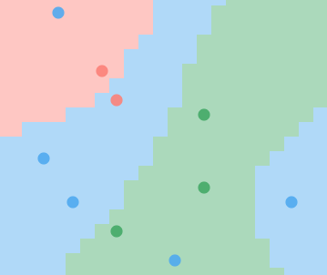

# Neuralizer

Simple point-and-click [neural network](https://en.wikipedia.org/wiki/Artificial_neural_network) based on [dennybritz/nn-from-scratch](https://github.com/dennybritz/nn-from-scratch/blob/master/nn_from_scratch.py), implemented in base **JavaScript** and still untested outside of **Google Chrome**.

---
**Click** to add data points, switch colors with `r` and `b`.

After creating some data, press `n` to train and run the neural network.

Press `l` to reload the page.
